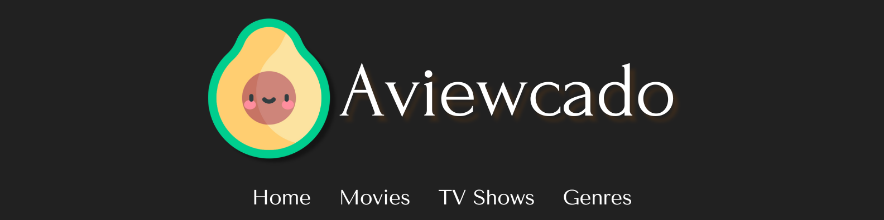

[Vist Aviewcado](https://aviewcado.vercel.app/)

Aviewcado is a website built with TypeScript and Angular that fetches and displays data on movies and TV shows from [The Movie Database](https://developer.themoviedb.org/docs/getting-started) (TMDB) API.

Users can browse movies and TV shows by genre or search by title. Once a specific movie or TV show is selected users are redirected to an overview page that displays details about the movie or show, photos of the cast, official videos and images, and TMDB reviews.

#
### Contributor: [Siyun Feng](https://www.linkedin.com/in/siyunfeng/)

#
### Contributions: 
- Designed a dynamic and responsive web interface by building reusable components and using the CSS Grid system.
- Created Angular services to fetch and display data from the TMDB API.

#
### Languages and Tools: 

